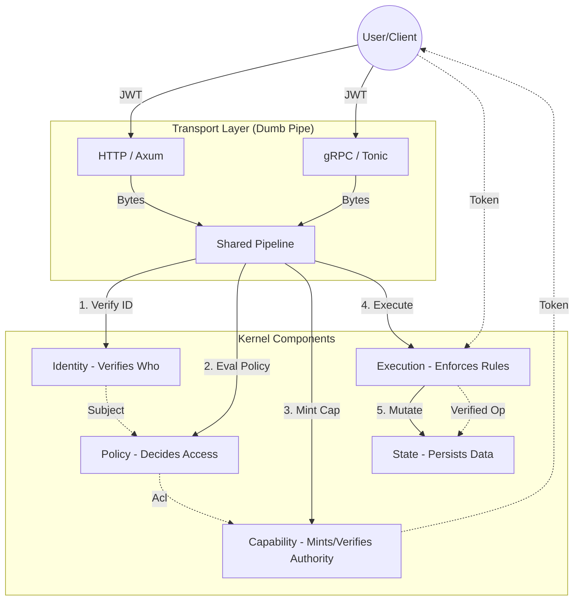
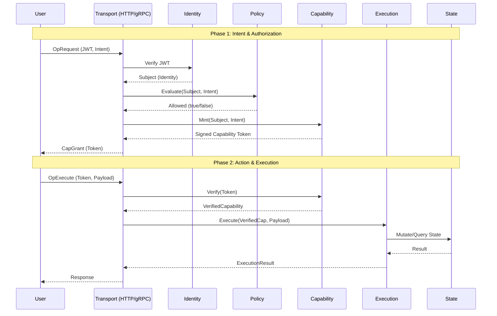

# Singularity Architecture

## 1. Purpose

Singularity is a **capability-based backend kernel** designed to provide secure, programmable data access without coupling identity, authorization, execution, or storage.

Singularity is **not**:
* an ORM
* a SQL abstraction
* a framework
* a BaaS

Singularity **is**:
* a backend execution kernel
* a capability authority
* a policy-driven state engine
* transport-agnostic (HTTP, gRPC, future transports)

---

## 2. Core Design Principles

### 2.1 Separation of Concerns

Each responsibility is isolated:

| Layer      | Responsibility           | Cannot Do              |
| ---------- | ------------------------ | ---------------------- |
| Identity   | Verify who the caller is | Decide access          |
| Policy     | Decide YES / NO          | Execute or mutate      |
| Capability | Encode authority         | Evaluate policy        |
| Execution  | Enforce authority        | Decide permissions     |
| State      | Persist data             | Authorize access       |
| Transport  | Marshal bytes            | Contain business logic |

No layer is allowed to “help” another.

### 2.2 Capability-First Security

All state mutation and access is gated by **short-lived, cryptographically signed capabilities**.

**Invariant:**
> No execution occurs without a verified capability.

Capabilities are:
* scope-limited
* resource-bound
* field-restricted
* time-bounded
* cryptographically verifiable

Identity tokens (JWT/OIDC) **cannot** directly access state.

### 2.3 Policy as Judgment, Not Power

Policies:
* return only [true](singularity/src/execution/constraint.rs#232-239) or [false](singularity/src/execution/constraint.rs#248-256)
* never mint capabilities
* never execute operations
* never mutate state

Policies run **only at capability issuance time**, never during execution.

### 2.4 Transport Agnosticism

Singularity behavior is **identical across transports**.

Supported transports:
* HTTP (Axum)
* gRPC (Tonic)

All transports delegate to a shared pipeline:
* [process_request](singularity/src/transport/pipeline.rs#14-68)
* [process_execute](singularity/src/transport/pipeline.rs#69-106)

Transport layers are intentionally “dumb”.

---

## 3. System Architecture Overview

---

## 4. Operational Flow (Sequence)

---

## 5. Module Responsibilities

### 5.1 `protocol/`
Defines wire-level messages:
* [OpRequest](singularity/src/protocol/request.rs#19-35) (intent)
* [CapGrant](singularity/src/protocol/grant.rs#142-150) (authority)
* [OpExecute](singularity/src/protocol/execute.rs#28-39) (execution)

No execution or policy logic exists here.

### 5.2 [identity/](singularity/src/identity/error.rs#64-69)
Responsible for:
* verifying identity tokens
* mapping claims to [PolicySubject](singularity/src/policy/context.rs#17-25)

Supports:
* JWT (HS256, RS256, ES256)
* static keys or JWKS

### 5.3 [policy/](singularity/src/policy/sandbox.rs#76-83)
Executes sandboxed Rhai expressions.

Guarantees:
* no I/O
* no loops or recursion
* bounded execution
* read-only context

Output is strictly boolean.

### 5.4 [capability/](singularity/src/protocol/types.rs#161-167)
Cryptographic authority layer.

Responsibilities:
* sign [CapabilityPayload](singularity/src/protocol/grant.rs#15-35)
* verify [CapabilityToken](singularity/src/protocol/grant.rs#101-102)
* enforce TTL, scope, resource, field, binding invariants

Capabilities are opaque to clients.

### 5.5 [execution/](singularity/src/capability/verifier.rs#160-253)
Execution engine that:
* requires [VerifiedCapability](singularity/src/capability/verifier.rs#39-42)
* enforces all invariants structurally
* delegates persistence to State

Execution cannot bypass capability checks.

### 5.6 [state/](singularity/src/execution/state_executor.rs#35-39)
Semantic persistence backend.

Characteristics:
* not a SQL abstraction
* not user-queryable
* model-aware
* schema-driven

SQLite is the reference backend.

### 5.7 [transport/](singularity/tests/transport_e2e.rs#22-133)
Exposes the kernel externally.

Transports:
* deserialize input
* invoke pipeline
* serialize output
* map errors to protocol-level responses

---

## 6. Security Invariants (Non-Negotiable)

1. **No state access without capability**
2. **No capability minting without policy approval**
3. **No execution during policy evaluation**
4. **No field access outside capability scope**
5. **No transport-specific behavior**
6. **No user-defined SQL**
7. **No silent schema widening**
8. **No long-lived authority tokens**
9. **Every CapabilityToken MUST contain explicit RowPredicate** (RLS is default-on)

Violating any invariant is a **bug**, not a feature.

---

## 7. Evolution Strategy

Planned evolution:
* Schema registry
* Persisted state
* Resource providers (S3/R2)
* Additional transports

Unplanned until proven safe:
* Multi-database support
* Distributed execution
* Long-lived sessions
